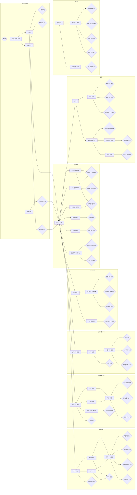

```mermaid
flowchart LR

  subgraph s1 ["인증/온보딩"]
    n1(("앱 시작"))
    n2["온보딩/역할 선택"]
    n3["회원가입"]
    n4["로그인"]
    n5{"소셜 로그인"}
    n6{"이메일 회원가입"}
    n55["역할 선택"]
    n56{"학생으로 시작"}
    n57{"학부모로 시작"}
  end

  subgraph s2 ["대시보드"]
    n7["대시보드 홈"]
    n8["투두 완료율 현황"]
    n9["성적 추이 그래프"]
    n10["학습 통계/피드백"]
    n11{"주간/월간 통계 조회"}
    n12{"피드백 메시지 확인"}
    n13{"총 학습시간 확인"}
    n58["디데이 위젯"]
    n59["오늘의 명언"]
    n60{"디데이 확인"}
    n61{"명언 카드 조회"}
    n62["명언 등록/관리(PC)"]
    n63{"명언 등록/수정/삭제"}
    n64{"노출 규칙 설정"}
  end

  subgraph s3 ["투두 관리"]
    n14["투두 관리"]
    n15["데일리 투두"]
    n16["주간 투두"]
    n17["투두 상세/편집"]
    n18{"투두 생성"}
    n19{"학습자료 연동"}
    n20{"투두 상태 변경"}
    n21{"완료 인증사진 첨부"}
    n22{"투두 메모 작성"}
    n23{"검색/태그 필터"}
  end

  subgraph s4 ["학습 자료 관리"]
    n24["학습 자료 관리"]
    n25["교재 목록"]
    n26["시험지 목록"]
    n27["자료 상세"]
    n28["주간 콘텐츠/영수증"]
    n29{"교재/시험지 등록"}
    n30{"과목별/폴더별 분류"}
    n31{"태그 추가/수정"}
    n32{"영수증 조회/출력"}
    n33{"키워드 검색"}
  end

  subgraph s5 ["캠스터디"]
    n34["캠스터디"]
    n35["캠스터디 진행화면"]
    n36["학습 타임라인"]
    n37{"웹캠 선택/시작"}
    n38{"자동 촬영 간격 설정"}
    n39{"캠스터디 종료"}
    n40{"타임라인 사진 조회"}
  end

  subgraph s6 ["성적/시험 관리"]
    n41["성적/시험 관리"]
    n42["시험 목록"]
    n43["시험 결과 상세"]
    n44{"시험 등록"}
    n45{"점수 입력"}
    n46{"복기 메모 작성"}
    n47{"과목별 성적 그래프"}
  end

  subgraph s7 ["설정"]
    n48["설정"]
    n49["알림 설정"]
    n50["계정/프로필 설정"]
    n51{"투두 알림 설정"}
    n52{"시험 알림 설정"}
    n53{"캠스터디 알림 설정"}
    n54{"크로스플랫폼 동기화"}
    n73["인증코드 발급"]
    n74{"코드 발급/복사"}
    n75["연동 관리"]
    n76{"학부모 연동 해제"}
  end

  subgraph s8 ["학부모"]
    n65["학부모 홈"]
    n66["학생 학습 현황"]
    n67{"투두 완료율 조회"}
    n68{"누적 학습시간 조회"}
    n69{"성적 추이 조회"}
    n70{"완료 인증 확인"}
    n71["인증코드 입력"]
    n72{"코드 입력 및 연동"}
  end

  n1 --> n2
  n2 --> n55
  n2 --> n4
  n3 --> n6
  n4 --> n5
  n4 --> n7
  n6 --> n7
  n7 --> n8
  n7 --> n9
  n7 --> n10
  n7 --> n14
  n7 --> n24
  n7 --> n34
  n7 --> n41
  n7 --> n48
  n8 --> n11
  n8 --> n13
  n10 --> n11
  n10 --> n12
  n9 --> n13
  n14 --> n15
  n14 --> n16
  n15 --> n17
  n16 --> n17
  n15 --> n18
  n16 --> n18
  n17 --> n19
  n17 --> n20
  n17 --> n21
  n17 --> n22
  n14 --> n23
  n24 --> n25
  n24 --> n26
  n24 --> n28
  n25 --> n27
  n26 --> n27
  n27 --> n29
  n27 --> n30
  n27 --> n31
  n28 --> n32
  n24 --> n33
  n34 --> n35
  n34 --> n36
  n35 --> n37
  n35 --> n38
  n35 --> n39
  n36 --> n40
  n41 --> n42
  n42 --> n43
  n42 --> n44
  n43 --> n45
  n43 --> n46
  n43 --> n47
  n48 --> n49
  n48 --> n50
  n49 --> n51
  n49 --> n52
  n49 --> n53
  n50 --> n54
  n55 --> n56
  n55 --> n57
  n56 --> n7
  n57 --> n65
  n7 --> n58
  n7 --> n59
  n58 --> n60
  n59 --> n61
  n7 --> n62
  n62 --> n63
  n62 --> n64
  n65 --> n66
  n65 --> n71
  n66 --> n67
  n66 --> n68
  n66 --> n69
  n66 --> n70
  n71 --> n72
  n50 --> n73
  n73 --> n74
  n50 --> n75
  n75 --> n76
```
